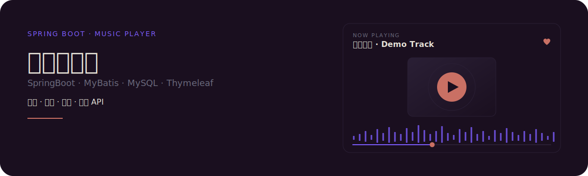
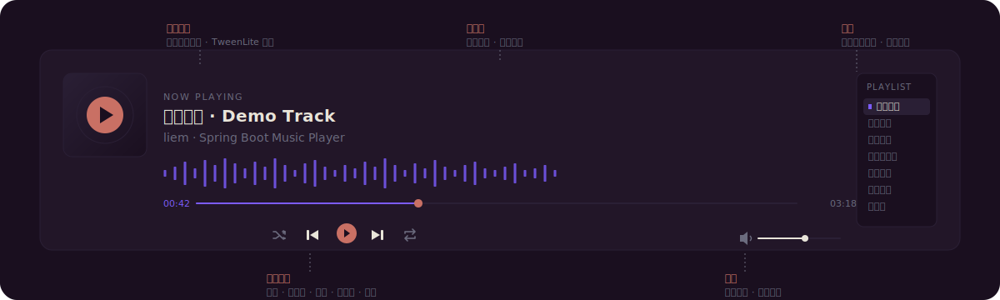
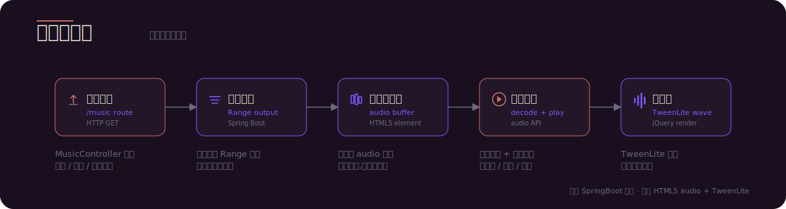
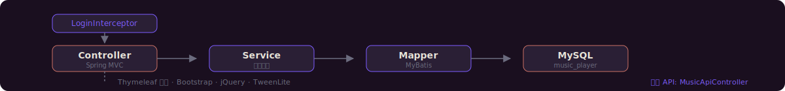
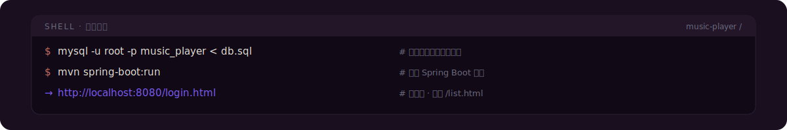
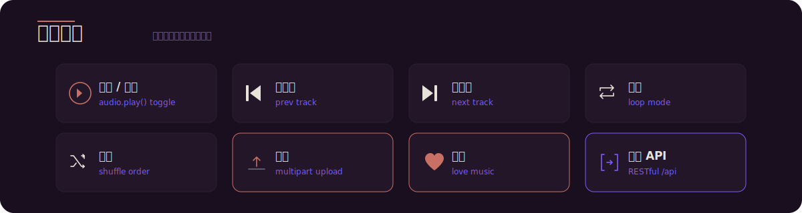
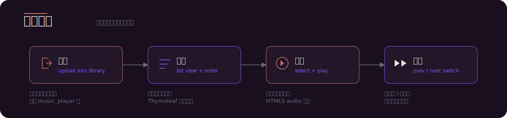
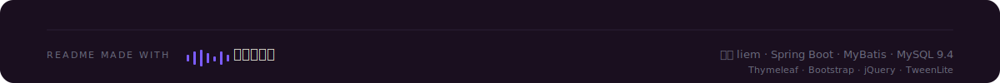

<p align="center">
  
</p>

---

## 这是什么

一个基于 **SpringBoot + MyBatis + MySQL** 的音乐播放器 Web 应用,支持音乐上传、在线播放、用户收藏,并提供对外音乐 API。前端使用 Thymeleaf + Bootstrap + jQuery,以 TweenLite 处理播放器动效。一个仓库跑通从持久化到音频可视化到对外接口的整条链路。

---

## 证据先于承诺

下方左侧为播放器界面解剖,右侧为仓库中真实存在的代码文件与对外接口文档,而非空头承诺。

<p align="center">
  
</p>

### Controller / Mapper 真实文件清单

| 层 | 文件 | 职责 |
| --- | --- | --- |
| 用户 | `controller/UserController` | 注册 / 登录 / 会话管理 |
| 音乐 | `controller/MusicController` | 列表 / 上传 / 在线播放 |
| 收藏 | `controller/LoveMusicController` | 收藏 / 取消收藏 |
| 对外 API | `controller/MusicApiController` | RESTful 音乐接口 |
| 拦截器 | `interceptor/LoginInterceptor` | 未登录请求拦截与重定向 |
| 持久化 | `mapper/*Mapper` + `mybatis/*.xml` | MyBatis 接口与 SQL 映射 |
| 辅助 | `assist/` · `tools/` | 会话与通用工具 |

### 文档

- [`音乐播放器文档.md`](音乐播放器文档.md) - 项目说明与设计
- [`MUSIC_API_使用指南.md`](MUSIC_API_使用指南.md) - 对外 API 调用指南
- [`项目运行截图.md`](项目运行截图.md) - 运行效果截图

---

## 为何不同

- **全栈一体**:后端 SpringBoot + MyBatis + MySQL,前端 Thymeleaf + Bootstrap + jQuery,以 TweenLite 处理播放器动效,一个仓库跑通整条链路。
- **不只是播放**:覆盖上传 → 列表 → 在线播放 → 收藏的完整用户闭环,而非只读播放器。
- **双入口**:除 Thymeleaf 页面外,`MusicApiController` 暴露 RESTful API,可供其他客户端接入。

---

## 工作原理

音频从一次 HTTP 请求到屏幕上的波形,要经过五个阶段。后端 SpringBoot 负责加载与流式输出,前端 HTML5 audio 负责缓冲与解码,TweenLite 驱动可视化动效。

<p align="center">
  
</p>

请求流层面,用户请求先经 `LoginInterceptor` 鉴权,再进入 Spring MVC `Controller`,调用 `Service` 业务层,通过 MyBatis `Mapper` 持久化到 `MySQL`;返回路径由 Thymeleaf 渲染视图。对外 API 走 `MusicApiController` 独立通道,与页面入口分离。

<p align="center">
  
</p>

---

## 快速开始

三步跑起来:导入表结构、启动 Spring Boot 服务、浏览器访问登录页。

<p align="center">
  
</p>

### 1. 建库

```sql
CREATE DATABASE music_player DEFAULT CHARACTER SET utf8mb4;
```

### 2. 导入表结构与数据

```bash
mysql -u root -p music_player < db.sql
```

### 3. 修改配置

编辑 `src/main/resources/application.yml`,填入本地 MySQL 账号、密码与端口。

### 4. 启动

```bash
mvn spring-boot:run
```

### 5. 访问

- 登录页:http://localhost:8080/login.html
- 音乐列表:http://localhost:8080/list.html

---

## 功能与播放能力

覆盖上传、在线播放、收藏与对外 API 的完整闭环。下方先看功能矩阵,再看歌单从入库到切歌的完整路径。

<p align="center">
  
</p>

<p align="center">
  
</p>

<p align="center">
  
</p>

---

## 对外 API

`MusicApiController` 提供音乐相关 RESTful 接口,可供第三方客户端调用。完整请求 / 响应示例与字段说明见 [`MUSIC_API_使用指南.md`](MUSIC_API_使用指南.md)。

---

## 项目结构

```
src/main/java/com/example/demo/
├── DemoApplication.java          # Spring Boot 启动类
├── controller/
│   ├── UserController            # 用户注册 / 登录
│   ├── MusicController           # 音乐列表 / 上传 / 播放
│   ├── LoveMusicController       # 收藏管理
│   └── MusicApiController        # 对外 RESTful API
├── service/                      # 业务逻辑层
├── mapper/                       # MyBatis 接口
├── model/                        # 实体类
├── interceptor/                  # LoginInterceptor 鉴权
├── assist/                       # 会话与辅助工具
└── tools/                        # 通用工具

src/main/resources/
├── application.yml               # 数据源与端口配置
├── mybatis/                      # Mapper XML 映射
└── static/                       # css / js / fonts / images

db.sql                            # 建表与初始数据
pom.xml                           # Maven 依赖
```

---

## 技术栈

| 层 | 技术 |
| --- | --- |
| 后端 | Spring Boot · MyBatis |
| 数据库 | MySQL 9.4 |
| 前端 | Thymeleaf · Bootstrap · jQuery · TweenLite |
| 构建 | Maven |

---

<p align="center">
  
</p>
